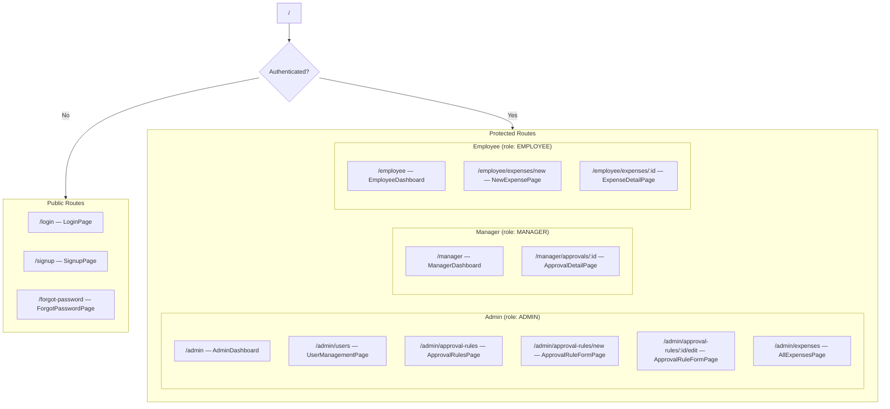
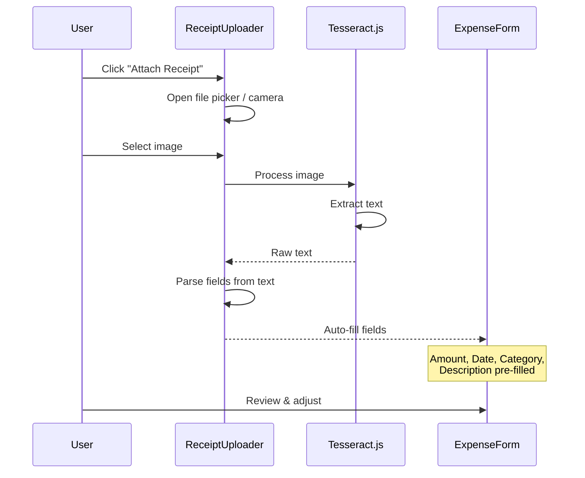
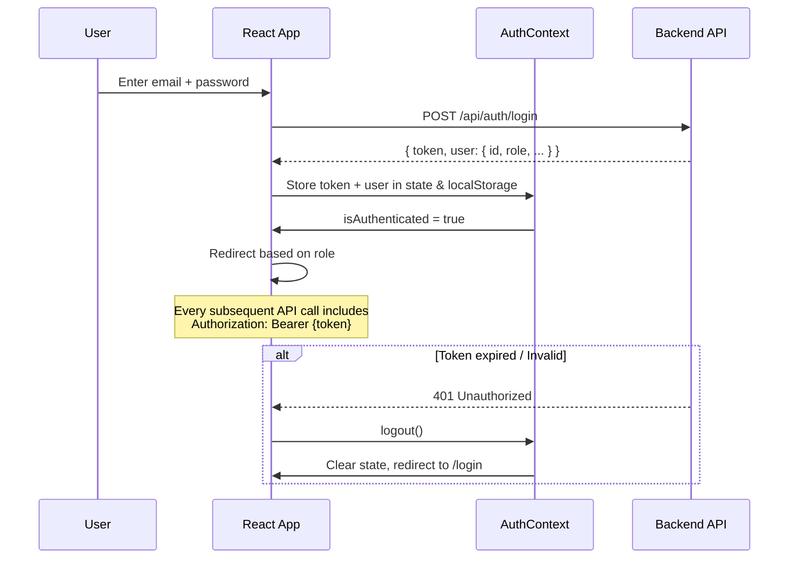

# Frontend Architecture — Reimbursement Management System

> Detailed frontend structure built with **React.js (JavaScript)**, **Vite**, and **React Router**, designed to be strictly compatible with the backend API structure defined in `backend.md`.

---

## Table of Contents

- [Tech Stack](#tech-stack)
- [Directory Structure](#directory-structure)
- [Routing Map](#routing-map)
- [Page Components (Screens)](#page-components-screens)
- [Shared Components](#shared-components)
- [Context & State Management](#context--state-management)
- [API Service Layer](#api-service-layer)
- [OCR Integration](#ocr-integration)
- [Currency Handling](#currency-handling)
- [Authentication Flow](#authentication-flow)
- [Role-Based Rendering](#role-based-rendering)
- [Screen-by-Screen Specification](#screen-by-screen-specification)

---

## Tech Stack

| Dependency           | Purpose                                   |
| -------------------- | ----------------------------------------- |
| react                | UI library                                |
| react-dom            | DOM rendering                             |
| react-router-dom     | Client-side routing                       |
| axios                | HTTP client for API calls                 |
| tesseract.js         | Client-side OCR for receipt scanning      |
| react-hot-toast      | Toast notifications                       |
| lucide-react         | Icon library                              |
| date-fns             | Date formatting utilities                 |

---

## Directory Structure

```
client/
├── public/
│   └── favicon.ico
├── src/
│   ├── components/                    # Reusable UI Components
│   │   ├── common/
│   │   │   ├── Button.jsx
│   │   │   ├── Input.jsx
│   │   │   ├── Select.jsx
│   │   │   ├── Table.jsx
│   │   │   ├── Modal.jsx
│   │   │   ├── Badge.jsx
│   │   │   ├── Card.jsx
│   │   │   ├── Loader.jsx
│   │   │   └── ConfirmDialog.jsx
│   │   ├── layout/
│   │   │   ├── Navbar.jsx
│   │   │   ├── Sidebar.jsx
│   │   │   ├── DashboardLayout.jsx
│   │   │   └── AuthLayout.jsx
│   │   ├── expense/
│   │   │   ├── ExpenseTable.jsx
│   │   │   ├── ExpenseForm.jsx
│   │   │   ├── ExpenseCard.jsx
│   │   │   ├── ExpenseSummaryBar.jsx    # "5467 rs To Submit | 33674 rs Waiting | 500 rs Approved"
│   │   │   ├── ReceiptUploader.jsx      # Upload + OCR trigger
│   │   │   ├── ApprovalLogTimeline.jsx  # Approver | Status | Time log
│   │   │   └── CurrencySelector.jsx     # Currency dropdown
│   │   ├── approval/
│   │   │   ├── ApprovalTable.jsx        # Manager's approval queue
│   │   │   ├── ApprovalActions.jsx      # Approve/Reject buttons
│   │   │   └── ApprovalRuleForm.jsx     # Admin approval rule config
│   │   └── user/
│   │       ├── UserTable.jsx            # Admin user management table
│   │       ├── UserForm.jsx             # Create/edit user modal
│   │       └── RoleBadge.jsx            # Role indicator badge
│   │
│   ├── pages/                           # Route-level Page Components
│   │   ├── auth/
│   │   │   ├── LoginPage.jsx
│   │   │   ├── SignupPage.jsx
│   │   │   └── ForgotPasswordPage.jsx
│   │   ├── employee/
│   │   │   ├── EmployeeDashboard.jsx    # Expense list + summary bar
│   │   │   ├── NewExpensePage.jsx       # Expense form + receipt upload
│   │   │   └── ExpenseDetailPage.jsx    # Read-only view after submit
│   │   ├── manager/
│   │   │   ├── ManagerDashboard.jsx     # Approvals to review table
│   │   │   └── ApprovalDetailPage.jsx   # Expense detail + Approve/Reject
│   │   ├── admin/
│   │   │   ├── AdminDashboard.jsx       # Overview + navigation
│   │   │   ├── UserManagementPage.jsx   # User CRUD table
│   │   │   ├── ApprovalRulesPage.jsx    # List of approval rules
│   │   │   ├── ApprovalRuleFormPage.jsx # Create/Edit approval rule
│   │   │   └── AllExpensesPage.jsx      # View all company expenses
│   │   └── NotFoundPage.jsx
│   │
│   ├── context/                         # React Context Providers
│   │   ├── AuthContext.jsx              # User auth state, login/logout
│   │   └── AppContext.jsx               # Global state (countries, currencies)
│   │
│   ├── services/                        # API Service Layer (axios)
│   │   ├── api.js                       # Axios instance with interceptors
│   │   ├── authService.js               # Login, signup, forgot password
│   │   ├── userService.js               # CRUD users, send password
│   │   ├── expenseService.js            # CRUD expenses, submit, upload
│   │   ├── approvalService.js           # Approve/reject, get pending
│   │   ├── approvalRuleService.js       # CRUD approval rules
│   │   ├── countryService.js            # Fetch countries + currencies
│   │   └── currencyService.js           # Currency conversion
│   │
│   ├── utils/                           # Utility Functions
│   │   ├── ocr.js                       # Tesseract.js wrapper + field parser
│   │   ├── currency.js                  # Format currency, conversion helpers
│   │   ├── validators.js                # Form validation helpers
│   │   ├── dateUtils.js                 # Date formatting
│   │   └── constants.js                 # Enums, categories, status labels
│   │
│   ├── hooks/                           # Custom React Hooks
│   │   ├── useAuth.js                   # Auth context hook
│   │   ├── useExpenses.js               # Expense CRUD hook
│   │   ├── useApprovals.js              # Approval queue hook
│   │   └── useCountries.js              # Countries/currencies fetcher
│   │
│   ├── assets/                          # Static Assets
│   │   └── logo.svg
│   │
│   ├── styles/                          # CSS Files
│   │   ├── index.css                    # Global styles + CSS variables
│   │   ├── auth.css                     # Auth page styles
│   │   ├── dashboard.css                # Dashboard layout styles
│   │   ├── expense.css                  # Expense-related styles
│   │   ├── approval.css                 # Approval-related styles
│   │   ├── table.css                    # Shared table styles
│   │   └── components.css               # Common component styles
│   │
│   ├── App.jsx                          # Root component + Router setup
│   └── main.jsx                         # Entry point
│
├── index.html
├── package.json
└── vite.config.js
```

---

## Routing Map

All routes are protected by role-based guards except auth pages.



| Route                                | Component              | Role     | Description                          |
| ------------------------------------ | ---------------------- | -------- | ------------------------------------ |
| `/login`                             | LoginPage              | Public   | Email + Password login               |
| `/signup`                            | SignupPage             | Public   | Admin registers company              |
| `/forgot-password`                   | ForgotPasswordPage     | Public   | Email-based password reset           |
| `/admin`                             | AdminDashboard         | Admin    | Admin overview                       |
| `/admin/users`                       | UserManagementPage     | Admin    | User CRUD table                      |
| `/admin/approval-rules`              | ApprovalRulesPage      | Admin    | List all approval rules              |
| `/admin/approval-rules/new`          | ApprovalRuleFormPage   | Admin    | Create new approval rule             |
| `/admin/approval-rules/:id/edit`     | ApprovalRuleFormPage   | Admin    | Edit approval rule                   |
| `/admin/expenses`                    | AllExpensesPage        | Admin    | View all company expenses            |
| `/manager`                           | ManagerDashboard       | Manager  | Approvals to review                  |
| `/manager/approvals/:id`             | ApprovalDetailPage     | Manager  | Approve/Reject expense               |
| `/employee`                          | EmployeeDashboard      | Employee | Expense list + summary               |
| `/employee/expenses/new`             | NewExpensePage         | Employee | Create expense (+ OCR)               |
| `/employee/expenses/:id`             | ExpenseDetailPage      | Employee | View expense + approval log          |

---

## Page Components (Screens)

### Legend (from Mockups)

The mockup wireframes define the following screens. Each screen below maps directly to the Excalidraw prototypes.

---

## Screen-by-Screen Specification

### 1. Signup Page (`/signup`)

**Mockup Reference:** Auth Screens — Admin (company) Signup Page

**Fields:**
| Field              | Type       | Validation                        | Notes                                                      |
| ------------------ | ---------- | --------------------------------- | ---------------------------------------------------------- |
| Name               | text       | Required, min 2 chars             | Admin user's full name                                     |
| Email              | email      | Required, valid email format      | Admin user's email                                         |
| Password           | password   | Required, min 8 chars             | Admin password                                             |
| Confirm Password   | password   | Must match password               | Confirmation field                                         |
| Country Selection  | dropdown   | Required                          | Fetched from REST Countries API. Sets company base currency |

**Behavior:**
- On submit → `POST /api/auth/signup`
- Auto-creates Company + Admin User
- Country selection populates from REST Countries API
- Selected country's currency is stored as company's `baseCurrency`
- Only 1 admin per company
- On success → Redirect to `/admin`

**API Call:** `POST /api/auth/signup` → `authService.signup()`

---

### 2. Login Page (`/login`)

**Mockup Reference:** Auth Screens — Signin Page

**Fields:**
| Field    | Type     | Validation                   |
| -------- | -------- | ---------------------------- |
| Email    | email    | Required, valid email format |
| Password | password | Required                     |

**Links:**
- "Don't have an account? Signup" → navigates to `/signup`
- "Forgot password?" → navigates to `/forgot-password`

**Behavior:**
- On submit → `POST /api/auth/login`
- Response contains JWT token + user data (role, name, companyId)
- Token stored in localStorage/httpOnly cookie
- Redirect based on role: Admin → `/admin`, Manager → `/manager`, Employee → `/employee`

**API Call:** `POST /api/auth/login` → `authService.login()`

---

### 3. Forgot Password Page (`/forgot-password`)

**Mockup Reference:** Auth Screens — "Forgot password?" link annotation

**Fields:**
| Field | Type  | Validation              |
| ----- | ----- | ----------------------- |
| Email | email | Required, valid email   |

**Behavior:**
- On submit → `POST /api/auth/forgot-password`
- Backend generates random password, sends via email (Nodemailer)
- User can then login with new password and change it from profile

**API Call:** `POST /api/auth/forgot-password` → `authService.forgotPassword()`

---

### 4. Admin — User Management Page (`/admin/users`)

**Mockup Reference:** User Management Table (bottom of auth/admin screen)

**Table Columns:**
| Column        | Type              | Notes                                              |
| ------------- | ----------------- | -------------------------------------------------- |
| User          | text (searchable) | Username with dynamic dropdown (can create on-fly)  |
| Role          | dropdown          | Options: `Manager`, `Employee`                      |
| Manager       | dropdown          | Dynamic dropdown of existing users (managers)       |
| Email         | email             | User's email address                                |
| Actions       | button            | "Send Password" button → emails random password     |

**Top Action:** "New" button → opens UserForm modal/inline-row

**Behavior:**
- Admin creates users by filling: name, role, manager, email
- "Send Password" generates random password and emails it
- User dropdown can create new user on-the-fly if no match found
- Role dropdown shows `Manager` and `Employee` only (admin is auto-created)
- Manager dropdown auto-selects based on user record, admin can change

**API Calls:**
- `GET /api/users` → Fetch all users in company → `userService.getAll()`
- `POST /api/users` → Create user → `userService.create()`
- `PUT /api/users/:id` → Update user → `userService.update()`
- `POST /api/users/:id/send-password` → Send password email → `userService.sendPassword()`

---

### 5. Admin — Approval Rules Page (`/admin/approval-rules`)

**Mockup Reference:** "Admin view (Approval rules)" screen

This is the full approval rule configuration form.

**Left Section (Rule Details):**
| Field                  | Type              | Notes                                                    |
| ---------------------- | ----------------- | -------------------------------------------------------- |
| User                   | dropdown          | Which employee this rule applies to (e.g., "marc")       |
| Description about rules| text             | E.g., "Approval rule for miscellaneous expenses"         |
| Manager                | dropdown (dynamic)| Pre-filled with user's assigned manager; admin can change |

**Right Section (Approvers Configuration):**
| Field                    | Type         | Notes                                                          |
| ------------------------ | ------------ | -------------------------------------------------------------- |
| Is manager an approver?  | checkbox     | If checked, approval request goes to manager first             |
| Approvers Table          | dynamic list | Columns: `#` (sequence), `User` (approver name), `Required` (checkbox) |
| Approvers Sequence       | checkbox     | If checked → sequential approval; if unchecked → parallel      |
| Minimum Approval %       | number input | e.g., 60 — percentage of approvers required                   |

**Approvers Table Detail:**
| # | User     | Required |
|---|----------|----------|
| 1 | John     | ✅ (checked) |
| 2 | Mitchell | ☐        |
| 3 | Andreas  | ☐        |

**"Required" Field Behavior:**
- If "Required" is ticked, then that approver's approval is **mandatory** in any approval combination
- If a required approver **rejects**, the expense is **auto-rejected**

**"Approvers Sequence" Behavior:**
- **Checked (Sequential):** Request goes to Approver 1 first; only after they approve/reject does it move to Approver 2, then 3, etc.
- **Unchecked (Parallel):** Request is sent to ALL approvers simultaneously

**"Is Manager an Approver?" Behavior:**
- If checked, approval request goes to the employee's manager **first**, before going to other approvers in the sequence

**"Minimum Approval %" Behavior:**
- Define what percentage of approvers must approve for the expense to be approved
- E.g., if 60% and there are 3 approvers, at least 2 must approve

**API Calls:**
- `GET /api/approval-rules` → List all rules → `approvalRuleService.getAll()`
- `GET /api/approval-rules/:id` → Get single rule → `approvalRuleService.getById()`
- `POST /api/approval-rules` → Create rule → `approvalRuleService.create()`
- `PUT /api/approval-rules/:id` → Update rule → `approvalRuleService.update()`
- `DELETE /api/approval-rules/:id` → Delete rule → `approvalRuleService.delete()`

---

### 6. Employee Dashboard (`/employee`)

**Mockup Reference:** "Employee's View" screen

**Summary Bar (top section):**
Three KPI cards showing:
| Card               | Value Example | Description                                    |
| ------------------ | ------------- | ---------------------------------------------- |
| To Submit          | 5467 rs       | Total amount of expenses in Draft status        |
| Waiting Approval   | 33674 rs      | Total amount of submitted/pending expenses      |
| Approved           | 500 rs        | Total amount of approved expenses               |

Arrows between cards indicate the expense flow: Draft → Waiting → Approved

**Action Buttons:**
- **Upload** — Opens receipt uploader (triggers OCR)
- **New** — Opens new expense form (manual entry)

**Expense Table Columns:**
| Column      | Type    | Notes                                      |
| ----------- | ------- | ------------------------------------------ |
| Employee    | text    | Name of the employee (current user)        |
| Description | text    | E.g., "Restaurant bill"                    |
| Date        | date    | E.g., "4th Oct, 2025"                      |
| Category    | text    | E.g., "Food"                               |
| Paid By     | text    | Who paid (e.g., employee name)             |
| Remarks     | text    | Optional remarks (e.g., "None")            |
| Amount      | number  | Amount with currency symbol (e.g., "5000 rs") |
| Status      | badge   | Draft (red circle) / Submitted (green circle) |

**Status Badge Colors:**
- `Draft` — Red outlined
- `Submitted` — Green outlined
- `Waiting Approval` — Yellow/Orange
- `Approved` — Green filled
- `Rejected` — Red filled

**API Calls:**
- `GET /api/expenses/my` → Get current user's expenses → `expenseService.getMyExpenses()`
- `GET /api/expenses/summary` → Get summary totals → `expenseService.getSummary()`

---

### 7. New Expense Page (`/employee/expenses/new`)

**Mockup Reference:** Expense Form Screen (large form)

**Top Bar:**
- **"Attach Receipt"** button → Opens file picker / camera → Triggers OCR → Auto-fills form
- **Status indicator:** Shows `Draft > Waiting approval > Approved` pipeline

**Form Fields (Left Column):**
| Field           | Type           | Notes                                               |
| --------------- | -------------- | --------------------------------------------------- |
| Description     | textarea       | Expense description                                 |
| Category        | dropdown       | Food, Travel, Office, Accommodation, Miscellaneous  |
| Total Amount    | number + dropdown | Amount input + Currency selector dropdown          |

**Form Fields (Right Column):**
| Field        | Type     | Notes                       |
| ------------ | -------- | --------------------------- |
| Expense Date | date     | Date of expense             |
| Paid By      | dropdown | Employee name / Company     |
| Remarks      | textarea | Optional additional notes   |

**Currency Selection:**
- Dropdown next to Total Amount field
- Employee can submit in **any currency** (USD, EUR, GBP, etc.)
- Amount auto-converted to company base currency on backend

**Description Field (bottom):**
- Additional long description area below the main form fields

**Approval Log Section (bottom of form - visible after submission):**
| Approver | Status   | Time                |
| -------- | -------- | ------------------- |
| Sarah    | Approved | 12:44 4th Oct, 2025 |

**Submit Button:**
- Large "Submit" button at the bottom
- On submit:
  - Expense status changes from `Draft` → `Submitted`
  - Form becomes **read-only**
  - Submit button becomes **invisible**
  - Approval workflow is triggered
  - Approval log becomes visible

**API Calls:**
- `POST /api/expenses` → Create expense (draft) → `expenseService.create()`
- `PUT /api/expenses/:id` → Update draft → `expenseService.update()`
- `POST /api/expenses/:id/submit` → Submit expense → `expenseService.submit()`
- `POST /api/expenses/:id/attachments` → Upload receipt → `expenseService.uploadAttachment()`

---

### 8. Expense Detail Page (`/employee/expenses/:id`)

**Behavior:**
- If status is `Draft`: Form is editable, submit button visible
- If status is `Submitted` / `Waiting Approval` / `Approved` / `Rejected`: Form is **read-only**, submit button **hidden**
- Approval Log Timeline visible when status ≥ `Submitted`

**API Calls:**
- `GET /api/expenses/:id` → Get expense detail → `expenseService.getById()`
- `GET /api/expenses/:id/approval-logs` → Get approval logs → `approvalService.getLogs()`

---

### 9. Manager Dashboard (`/manager`)

**Mockup Reference:** "Manager's View" screen — "Approvals to review"

**Page Title:** "Approvals to review"

**Table Columns:**
| Column                              | Type    | Notes                                             |
| ----------------------------------- | ------- | ------------------------------------------------- |
| Approval Subject                    | text    | Subject/title of the approval                     |
| Request Owner                       | text    | Employee who submitted (e.g., "Sarah")            |
| Category                            | text    | Expense category (e.g., "Food")                   |
| Request Status                      | badge   | Current status (e.g., "Approved")                 |
| Total Amount (in company's currency)| text    | Shows original amount in red (e.g., "567 $ (in INR)") then "= 49896" in company currency |
| Actions                             | buttons | **Approve** (green) + **Reject** (red) buttons    |

**Amount Display Logic:**
- Original amount shown in red: e.g., `567 $ (in INR)`
- Converted amount shown: `= 49896`
- Conversion is real-time using ExchangeRate API

**Button Behavior:**
- **Approve:** Approves the expense for this approver. If sequential, triggers next approver.
- **Reject:** Rejects the expense for this approver. If "required" approver, auto-rejects entire expense.
- Once approved/rejected by manager: record becomes **read-only**, buttons become **invisible**, status field updates.

**API Calls:**
- `GET /api/approvals/pending` → Get pending approvals for current manager → `approvalService.getPending()`
- `POST /api/approvals/:expenseId/approve` → Approve → `approvalService.approve()`
- `POST /api/approvals/:expenseId/reject` → Reject → `approvalService.reject()`

---

### 10. Admin — All Expenses Page (`/admin/expenses`)

Reuses the `ExpenseTable` component with admin-level access (all company expenses visible).

**API Call:** `GET /api/expenses/all` → `expenseService.getAll()`

---

## Shared Components

### ExpenseSummaryBar
```
┌──────────────┐    →    ┌──────────────────┐    →    ┌──────────────┐
│  5467 rs     │         │  33674 rs        │         │  500 rs      │
│  To submit   │         │  Waiting approval│         │  Approved    │
└──────────────┘         └──────────────────┘         └──────────────┘
```
- Three cards showing aggregated amounts by status
- Arrows between cards showing the flow

### ReceiptUploader
- Supports: Image upload from computer OR camera capture
- On upload → Tesseract.js processes the image
- Extracted text is parsed to fill: amount, date, description, category, vendor

### ApprovalLogTimeline
```
┌──────────┬──────────┬────────────────────┐
│ Approver │  Status  │       Time         │
├──────────┼──────────┼────────────────────┤
│ Sarah    │ Approved │ 12:44 4th Oct, 2025│
│ John     │ Pending  │ —                  │
└──────────┴──────────┴────────────────────┘
```

### CurrencySelector
- Dropdown populated from REST Countries API
- Shows currency code + symbol
- Used in expense form for amount currency selection

---

## Context & State Management

### AuthContext (`context/AuthContext.jsx`)
```javascript
{
  user: {
    id, name, email, role,          // "ADMIN" | "MANAGER" | "EMPLOYEE"
    companyId, baseCurrency,
    managerId
  },
  token: "jwt-token-string",
  isAuthenticated: boolean,
  login(email, password),
  signup(data),
  logout(),
  loading: boolean
}
```

### AppContext (`context/AppContext.jsx`)
```javascript
{
  countries: [...],                  // From REST Countries API
  currencies: [...],                 // Extracted from countries data
  exchangeRates: {...},              // Cached conversion rates
}
```

---

## API Service Layer

### `services/api.js` — Axios Instance
```javascript
// Base URL: http://localhost:5000/api
// Interceptors:
//   - Request: Attach JWT token from localStorage
//   - Response: Handle 401 → redirect to login
```

### Service Files Map to Backend Routes

| Service File             | Backend Route Prefix        | Methods                                    |
| ------------------------ | --------------------------- | ------------------------------------------ |
| `authService.js`         | `/api/auth`                 | signup, login, forgotPassword              |
| `userService.js`         | `/api/users`                | getAll, create, update, delete, sendPassword |
| `expenseService.js`      | `/api/expenses`             | getMyExpenses, getAll, getById, create, update, submit, uploadAttachment, getSummary |
| `approvalService.js`     | `/api/approvals`            | getPending, approve, reject, getLogs       |
| `approvalRuleService.js` | `/api/approval-rules`       | getAll, getById, create, update, delete    |
| `countryService.js`      | External API                | fetchCountries                             |
| `currencyService.js`     | External API + `/api/currency` | getExchangeRates, convert               |

---

## OCR Integration

### `utils/ocr.js`

```javascript
// Uses Tesseract.js to:
// 1. Load the image
// 2. Run OCR recognition
// 3. Extract raw text
// 4. Parse text with regex patterns to identify:
//    - Total Amount (look for "Total", "Grand Total", "$", "₹")
//    - Date (various date formats)
//    - Vendor Name (typically first line or prominent text)
//    - Category (keyword matching: food, travel, office, etc.)
//    - Description (remaining relevant text)
// 5. Return structured object:
//    { amount, currency, date, vendorName, category, description }
```

### OCR Flow in UI


---

## Currency Handling

### Display Logic

| Context                | Display Format                                |
| ---------------------- | --------------------------------------------- |
| Employee submits       | `567 $` (original currency)                   |
| Employee dashboard     | `5000 rs` (in submitted currency)             |
| Manager dashboard      | `567 $ (in INR) = 49,896` (converted amount)  |
| Admin all expenses     | Both original and converted amounts           |

### Conversion Flow
1. Employee selects currency (e.g., USD) and enters amount (e.g., 567)
2. On submission, backend fetches real-time rate from ExchangeRate API
3. `convertedAmount = amount × rate` stored alongside original
4. Manager's view displays both: original in red, converted in company currency

---

## Authentication Flow



---

## Role-Based Rendering

### App.jsx Router Structure

```jsx
<Routes>
  {/* Public Routes */}
  <Route element={<AuthLayout />}>
    <Route path="/login" element={<LoginPage />} />
    <Route path="/signup" element={<SignupPage />} />
    <Route path="/forgot-password" element={<ForgotPasswordPage />} />
  </Route>

  {/* Protected Routes */}
  <Route element={<ProtectedRoute allowedRoles={["ADMIN"]} />}>
    <Route element={<DashboardLayout />}>
      <Route path="/admin" element={<AdminDashboard />} />
      <Route path="/admin/users" element={<UserManagementPage />} />
      <Route path="/admin/approval-rules" element={<ApprovalRulesPage />} />
      <Route path="/admin/approval-rules/new" element={<ApprovalRuleFormPage />} />
      <Route path="/admin/approval-rules/:id/edit" element={<ApprovalRuleFormPage />} />
      <Route path="/admin/expenses" element={<AllExpensesPage />} />
    </Route>
  </Route>

  <Route element={<ProtectedRoute allowedRoles={["MANAGER"]} />}>
    <Route element={<DashboardLayout />}>
      <Route path="/manager" element={<ManagerDashboard />} />
      <Route path="/manager/approvals/:id" element={<ApprovalDetailPage />} />
    </Route>
  </Route>

  <Route element={<ProtectedRoute allowedRoles={["EMPLOYEE"]} />}>
    <Route element={<DashboardLayout />}>
      <Route path="/employee" element={<EmployeeDashboard />} />
      <Route path="/employee/expenses/new" element={<NewExpensePage />} />
      <Route path="/employee/expenses/:id" element={<ExpenseDetailPage />} />
    </Route>
  </Route>

  <Route path="*" element={<NotFoundPage />} />
</Routes>
```

### ProtectedRoute Component
```jsx
// Checks:
// 1. Is user authenticated? (token exists & valid)
// 2. Does user's role match allowedRoles?
// If no → redirect to /login
// If yes → render <Outlet />
```

---

## Key Frontend Patterns

### 1. Expense Form State Machine
```
EDITABLE (Draft) → READ_ONLY (Submitted/Approved/Rejected)
- Draft: All fields editable, Submit button visible
- Submitted+: All fields disabled, Submit button hidden, Approval log visible
```

### 2. Real-time Amount Conversion
```
On Manager Dashboard:
  Original: "567 $ (in INR)" (shown in red)
  Converted: "= ₹49,896" (shown in black)
  Formula: amount × exchangeRate[from][to]
```

### 3. Expense Summary Aggregation
```
Employee Dashboard — Summary Bar:
  To Submit = SUM(amount) WHERE status = 'DRAFT'
  Waiting Approval = SUM(amount) WHERE status IN ('SUBMITTED', 'WAITING_APPROVAL')
  Approved = SUM(amount) WHERE status = 'APPROVED'
```
